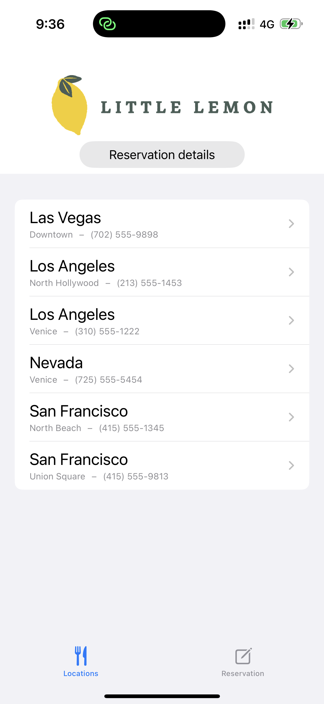
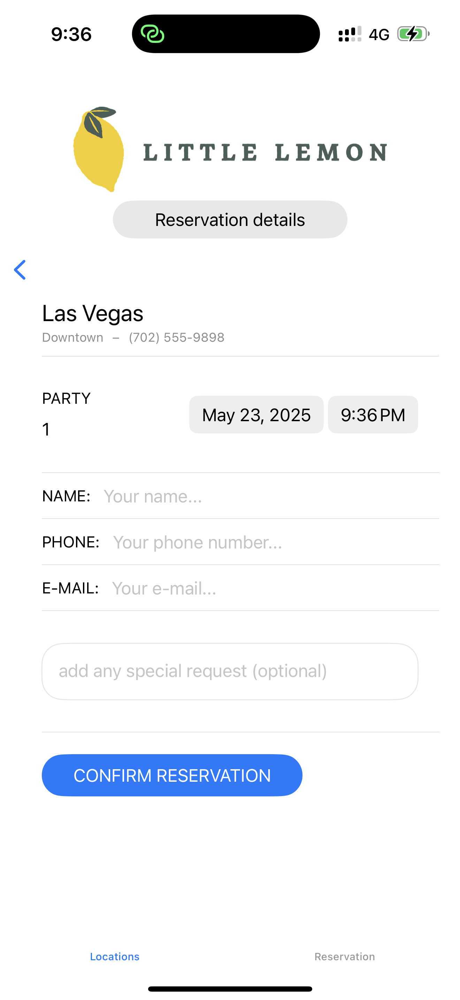
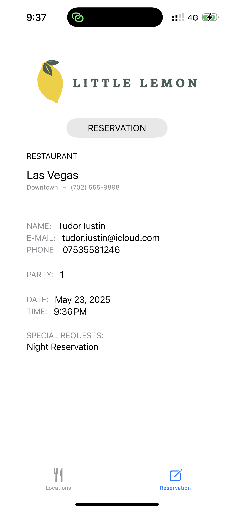

# Little Lemon Restaurant iOS App

## Overview
Little Lemon Restaurant iOS App is a SwiftUI-based application that allows users to browse restaurant locations and make table reservations with ease. The app is designed for a smooth, mobile-first experience, focusing on clarity, efficiency, and a welcoming brand identity.

---

## Features
- **Browse Locations:** View a list of Little Lemon restaurant locations, each with city, neighborhood, and phone number.
- **Make Reservations:** Select a location, choose party size, date, and time, and enter your contact details to reserve a table.
- **Reservation Summary:** Instantly view a summary of your reservation, including all details and special requests.
- **Modern UI:** Clean, intuitive interface built with SwiftUI and following iOS best practices.

---

## App Architecture
- **SwiftUI:** The entire UI is built using SwiftUI for a declarative, modern approach.
- **MVVM Pattern:** The app uses a MVVM-like structure with a shared `Model` class for state management.
- **Navigation:** Utilizes `TabView` for main navigation and `NavigationView` for location and reservation flows.

### Key Components
- `Model.swift`: Holds the list of restaurants and reservation state.
- `LocationsView.swift`: Displays all restaurant locations.
- `ReservationForm.swift`: Form for entering reservation details.
- `ReservationView.swift`: Shows the reservation summary.
- `RestaurantLocation.swift` & `Reservation.swift`: Data models for locations and reservations.

---

## Screenshots

### 1. Home – Locations List
Browse all available Little Lemon locations.



### 2. Create Reservation
Select party size, date, time, and enter your contact information.



### 3. Reservation Summary
View a summary of your reservation, including all details and special requests.



---

## How to Run the App
1. **Open in Xcode:**
   - Open `StartingProject.xcodeproj` in Xcode (version 14 or later recommended).
2. **Build & Run:**
   - Select an iOS Simulator or your device.
   - Press `Cmd+R` to build and run the app.
3. **Explore:**
   - Browse locations, make a reservation, and view your reservation summary.

---

## Project Structure
```
StartingProject/
├── Assets.xcassets/
├── LocationsView.swift
├── MainView.swift
├── Model.swift
├── RESERVATION/
│   ├── ReservationForm.swift
│   ├── ReservationView.swift
│   └── Reservation.swift
├── RESTAURANT/
│   ├── RestaurantLocation.swift
│   └── RestaurantView.swift
└── StartingProjectApp.swift
```

## License
This project is for educational purposes only. 
